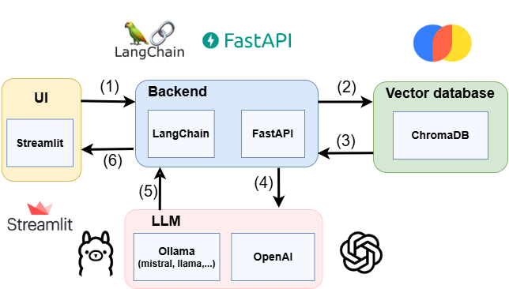

# QA Chatbot

## ⚠️ Disclaimer

This project is in an experimental phase and remains under active development. Please use it with caution and understand that you do so at your own risk.

## Architecture


 

## Docker setup
### Set environment variables
* **Prepare the docker environment**:
- Open the file named `.env-example`.  
   - Replace the placeholder configurations with your actual settings:  

     ```bash
     # For OpenAI configuration
     OPENAI_KEY="your-openai-key"

     # Default model settings
     MODEL_NAME="gpt-4o-mini"
     EMBEDDING_MODEL_NAME="text-embedding-3-small"
     TEMPERATURE=0.0
     ```
   - **If using OpenAI models**, make sure `OPENAI_KEY` is set, and you can select `MODEL_NAME` and `EMBEDDING_MODEL_NAME` from [https://platform.openai.com/docs/models](https://platform.openai.com/docs/models).  
   - **If using Ollama**, remove `OPENAI_KEY` from the environment to avoid conflicts, and you can select `MODEL_NAME` and `EMBEDDING_MODEL_NAME` from [https://www.ollama.com/search](https://www.ollama.com/search).   
   - Save and close the file.  
   - Rename the file to `.env`.  


 * **Prepare the ollama environment**:
  1. Start the Ollama Docker image using `docker-compose`
  ```sh
    docker-compose start ollama
  ```
  2. Pull a model supported by Ollama. You can find Ollama models [here](https://ollama.com/search) and replace `mistral` with another model, and `avr/sfr-embedding-mistral` with another embedding.
  ```sh
      docker exec -it ollama ollama pull mistral
      docker exec -it ollama ollama pull avr/sfr-embedding-mistral
  ```

### Documents Setup
Since this project is based on context (RAG), all files in the `*.txt` format should be added to the `backend/docs` folder.  

Please note that if you modify the models, you should ensure the embedding dimensions are correct. Otherwise, you can delete the existing data in `chromaDB` by calling the following function from your browser after running the server, and then restart the server to re-embed the docs automatically:

```sh
http://localhost:5000/delete-collection
```

### Build & RUN
 ```sh
      docker compose up --build -d
  ``` 
### RUN
 ```sh
      docker compose up -d
  ``` 
## Development setup

### Prerequisites

You can skip this part if your system meets all the requirements listed below 👇

* [Backend requirements](./backend/README.md)
* [Frontend requirements](./frontend/README.md)

### Install dependencies & set environment variables
* **Clone** the project in your preferred IDE (e.g. VScode)
* **Prepare the backend environment**:
    1. Navigate to the backend using `backend` folder: `cd backend`
    2. Create a virtual environment for dependencies called `env` using the following command: 
        ```sh 
          python -m venv env
        ```
    3. Activate the created `env` by running:
        * **Windows**: 
        ```sh 
          env\Scripts\activate.bat
        ```
        * **Unix/MacOS**:
        ```sh
          env/bin/activate
        ```
    4. Install the required libraries listed in `requirements.txt` by running:
        ```sh
          pip install -r requirements.txt
        ```
* **Prepare the frontend environment**:
    1. Navigate to the `frontend` folder: `cd ../frontend` 
    2. follow the same steps of the `backend` environment

* **Set Up Environment Variables**:  
   - Open the file named `.env-example`.  
   - Replace the placeholder configurations with your actual settings:  

     ```bash
     # For OpenAI configuration
     OPENAI_KEY="your-openai-key"

     # For Ollama configuration
     LLM_BASE_URL="http://localhost:11434"

     # Default model settings
     MODEL_NAME="gpt-4o-mini"
     EMBEDDING_MODEL_NAME="text-embedding-3-small"
     TEMPERATURE=0.0

      #for backend configuration
      API_BASE_URL="http://localhost:5000"

     # Database configuration
     CHROMA_DB_SERVER_HOST="localhost"
     CHROMA_DB_SERVER_PORT=8000
     CHROMA_DB_COLLECTION_NAME="docs_collection"
     ```

   - **If using OpenAI models**, make sure `OPENAI_KEY` is set, and you can select `MODEL_NAME` and `EMBEDDING_MODEL_NAME` from [https://platform.openai.com/docs/models](https://platform.openai.com/docs/models).  
   - **If using Ollama**, remove `OPENAI_KEY` from the environment to avoid conflicts, and you can select `MODEL_NAME` and `EMBEDDING_MODEL_NAME` from [https://www.ollama.com/search](https://www.ollama.com/search).  
   - Save and close the file.  
   - Rename the file to `.env`.  
  
* **Prepare the ollama environment**:
  1. Start the Ollama Docker image using `docker-compose`
  ```sh
    docker-compose start ollama
  ```
  2. Pull a model supported by Ollama. You can find Ollama models [here](https://ollama.com/search) and replace `mistral` with another model, and `avr/sfr-embedding-mistral` with another embedding.
  ```sh
      docker exec -it ollama ollama pull mistral
      docker exec -it ollama ollama pull avr/sfr-embedding-mistral
  ```
* **Prepare the ChromaDB environment**:
  1. Start the ChromaDB Docker image using `docker-compose`
  ```sh
    docker-compose start chromadb
  ```
### Documents Setup
Since this project is based on context (RAG), all files in the `*.txt` format should be added to the `backend/docs` folder.  

Please note that if you modify the models, you should ensure the embedding dimensions are correct. Otherwise, you can delete the existing data in `chromaDB` by calling the following function from your browser after running the server, and then restart the server to re-embed the docs automatically:

```sh
http://localhost:5000/delete-collection
```

### Run
1. Navigate to the backend using `backend` folder: `cd backend`
2. Run the application:
    ```sh
    uvicorn app:app --host 0.0.0.0 --port 5000 --reload
    ```
3. Open a new terminal and navigate to the `frontend`folder: `cd frontend`
4. Run the development web server: 
    ```sh
    streamlit run app.py --server.port=8080 --server.address=0.0.0.0
    ```
5. Access the web application on the displayed localhost: http://localhost:8080 
